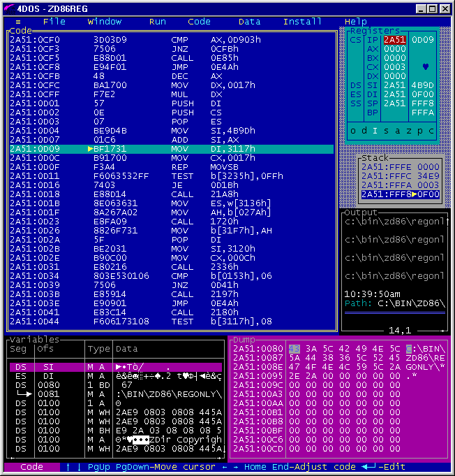

# [fit] I. Intro to Programming

---

## SWBAT (Students Will Be Able To)

- Grasp the basic concepts of what programming is
- Understand what Javascript is used for
- Understand the goals of the TODO application
- Grasp and practice the basics of Javascript syntax
- Complete an assessment and extra credit assignment

---

## Basics of programming

- We will be covering in this section a very high level overview of what programming is
- From here on out, any terminology will be **bolded**
- Code will be displayed in `monospace`.

---

## Code

- **Source Code** or just **Code**, is a set of special instructions a computer reads in order to know what tasks to perform
- Usually, this code is saved in a file, although for javascript we can also type it into the browser for either practice or debugging purposes (more on this later)
- **Computer Language** or **Syntax**, are the rules for the valid format of this language

---

This is English.

lkjoer/I#(?)

that is not --^

---

`var student = 'Tom';` is valid Javascript

`varr student 'Tom';` is not and will result in the computer throwing it's hands up in the air

---

## Expressions

- An **Expression** is any reference to a value, or a set of value(s) and/or value(s) combined with operators
- For example:
  - `a = b * 2;`
  - `a` and `b` are called **variable expression**
      - means retrieve it's current value

---

## Expressions

- For example:
  - `a = b * 2;`
  - `2` is a **literal value expression**
      - it is named as such because it is not stored inside of a variable
  - `b * 2` is an **arithmetic expression**
  - `a = b * 2` is an **assignment expression**

---

## Statements

- In a computer language, a group of words, numbers, and operators that performs a specific task is called a **Statement**
- It is a collection of expressions
- Example
  - `a = 4 * 2;`
  - `a` and `b` are called a **variable**
      - boxes that hold values
  - `=` and `*` are operators
      - they perform actions
- Most statements in Javascript conclude with a semicolon

---

## Statements

- Example
  - `a = 4 * 2;`
  - `=` and `*` are operators
      - they perform actions
- Most statements in Javascript conclude with a semicolon

---

## Executing a Program

- So how does the computer interpret all this?
- The statements in the above examples are helpful for us to read, but the computer can't actually read that as written
- To be "executed" a special utility on the computer is used to translate the code into **machine language** the computer can understand
    - One such utility is an "compiler" that translates Javascript into machine-readable code

---



---

> Javascript is the duct tape of the internet
-- Charlie Campbell

---

# [fit] II. Javascript

---

Let's try a bit of code before we continue

- Open your favorite browser (not IE)
- Open the console on any page
    - either in "settings" or try "cmd/ctrl + opt/alt + j"

---

## Javascript

- The history of [Javascript](https://embedwistia-a.akamaihd.net/deliveries/02b2a82f133a6d2c55210097cfb6e0daa04cf380/file.mp4)
- How HTML, CSS, and Javascript work together
- How you add it to the browser
    - take a look at adding-js.html

---

## Syntax
### Comments

- There are two ways to declare comments

```
// This is an in-line comment

/* This is a multi-line
   comment */
```

---

## Syntax
### Variables

- **Variables** allow computers to store and manipulate data dynamically.  When you create a variable you are essentially creating a label for the computer to use as an identifier for that data point.
`var userName`

*Instructions*
Initialize a variable.

---

## Syntax
### Assignment Operator

- You can also store values to a variable by with the **assignment** operator `=`
- Everything to the right of the `=` is evaluated first

`var userName = 'Micky';`
`var x = 12 + 1;`
`var isTrue = true;`

*Instructions*
Create a variable that holds your first name.

---

- About naming things....
  - Be wary of reserved keywords
  - Pick a name that makes sense

---

## Syntax
### Warning!


- You can override variables  
- This is know as reassigning or compound assignment

```
var a = 12;
a = 16;
// can also reassign to it's original value
a = a + 12;
```


---

## Syntax
### Value Types

- Let's talk about Javascript's 6 different value types
  - number
  - string
  - null
  - undefined
  - boolean
  - object

---

## Syntax
### Value Types

-  **Value Types** are values that can be assigned to a variable

```
var a = 12 // number
var myDog = 'Osito' // string
var isTrue = true // boolean
var isFalse = false // boolean
var no = null
var who = undefined

```

---

## Syntax
### Arithmetic

- Addition
`var adding = 5 + 10;`
`console.log(adding) // 15`

- `-` subtract
- `*` multiply
- `/` divide

---

*Instructions*

- Practice adding, subtracting, and dividing numbers.

---

## Syntax
### Arithmetic

- You can also **increment** numbers with the `++` operator

```
var a = 12;
a++; //13
a = a + 1; //14
```

- How would you **decrement** a number?

---

*Instructions*

- Practice incrementing and decrementing a number

---

## Syntax
### Arithmetic

- We can store decimal numbers in variables too. Decimal numbers are sometimes referred to as **floating point** numbers or floats.

`var myDecimal = 7.9;`

---

## Syntax
### Arithmetic

- The **remainder** operator `%` gives the remainder of the division of two numbers.

```
var x = 12 % 6;
console.log(x) // 0
var y = 10 % 4;
console.log(y) // 2
```
- In mathematics, a number can be checked even or odd by checking the remainder of the division of the number by 2.

---

*Instructions*

- Check whether `19` is odd
- Check whether `12` is even

---

## Syntax
### Compound Assignment

- Sometimes you'll need to use assignments to modify the contents of a variable
`var myVar = 1;`
`myVar = myVar + 5; //6 `
- We can do this in one step
`myVar += 5; //6`

---

*Instructions*

- Initialize a variable with a numerical value
- Use compound assignment to add any number to the original value

---
## Syntax
### Compound Assignment

- We can do the same with all other forms of operators

*Instructions*

- Do the same as the previous exercise but for `-`, `*`, `/`.

---

## Quiz!


- Every so often I will present you with an exercise to test what we've learned so far
- You will have about 5 to 20 mins depending on the difficulty of the quiz
- Please try these exercises for at least 5 to 10 mins before asking for help

---

- The algorithm to convert Celsius to Fahrenheit:
  - `fahrenheit` equals `celsius` times `9/5` plus `32`.
- Plug the `function` on the next page into our online repl and modify the code in-between the lines.

---

```
function convertToF(celsius) {
  var fahrenheit;
  // Only change code below this line

  // Only change code above this line
  return fahrenheit;
}

convertToF(30);

```

---
## Syntax
---
